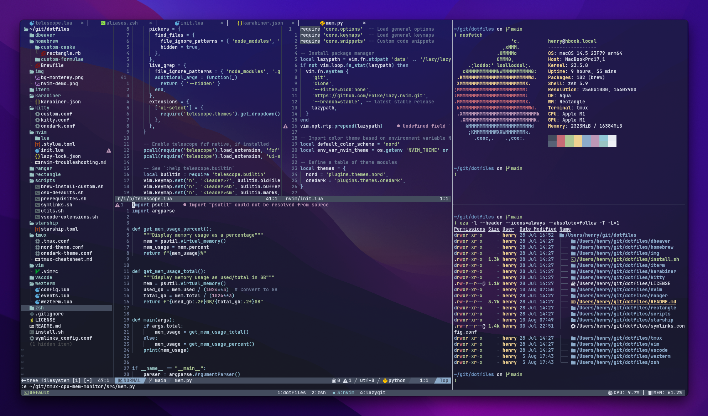

# My dotfiles

This repository contains my dotfiles, which are the configuration files and scripts I use to customize my development environment.

These dotfiles help me maintain a consistent setup across different machines and save time when setting up new environments.



## Getting Started

To set up these dotfiles on your system, follow these simple steps:

1. Make sure the install script is executable: `chmod +x ./install.sh`
2. Run the script: `./install.sh`
3. Follow the on screen prompts.

## Uninstalling

If you ever want to remove the symlinks created by the installation script, you can use the provided symlinks removal script:

1. Before running the symlinks removal script, make sure it is executable: `chmod +x ./scripts/symlinks.sh`
2. To delete all symlinks created by the installation script, run: `./scripts/symlinks.sh --delete`

This will remove the symlinks but will not delete the actual configuration files, allowing you to easily revert to your previous configuration if needed.

## Adding New Dotfiles and Software

### Dotfiles

When adding new dotfiles to this repository, follow these steps:

1. Place your dotfile in the appropriate location within the repository.
2. Update the `scripts/symlinks_config.conf` file to include the symlink creation for your new dotfile.
3. If necessary, update the `install.sh` script to set up the software.

### Software Installation

If you install new software, especially using Homebrew, here's a useful tip:

- You can easily manage the software you've installed via Homebrew by using a `Brewfile`. To generate a `Brewfile` with a list of all installed software and their descriptions, run the following command:

```bash
brew bundle dump --describe
```

## Customization

Feel free to customize the dotfiles to match your preferences. You can modify the configurations, add new dotfiles, or remove existing ones. Be cautious when making changes, and always back up your existing configurations.

## License

This project is licensed under the MIT License - see the LICENSE file for details.
