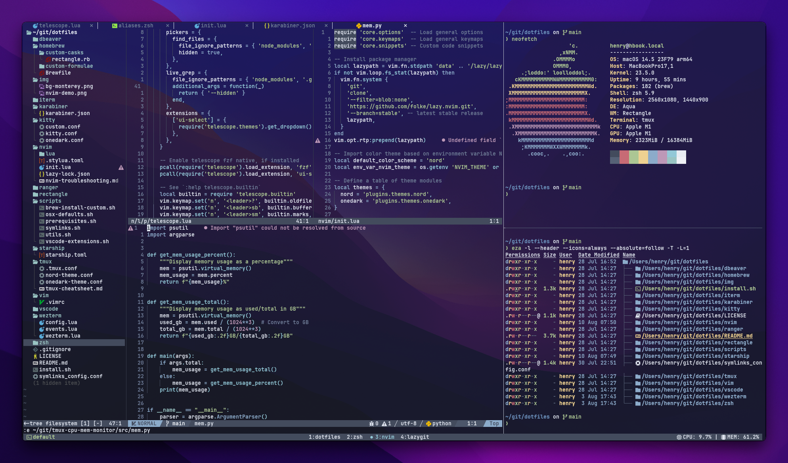

# Dotfiles

My config files for maintaining a consistent dev environment across machines.



## Essential Tools

- **Editor**: [NeoVim](https://neovim.io/), with a lightweight [Vim](https://www.vim.org/) fallback config (no dependencies) for maximum portability.
- **Multiplexer**: [Herdr](https://herdr.dev/), my daily driver since it is agent-first and a lot of my work these days runs through coding agents. [Tmux](https://github.com/tmux/tmux/wiki) stays as a fallback, it has served me well for years. Both are configured to share the same muscle memory, so switching between them is seamless.
- **Main Terminal**: [Ghostty](https://ghostty.org/) (Previously: [WezTerm](https://wezfurlong.org/wezterm/index.html))
- **Shell Prompt**: [Starship](https://starship.rs/)
- **Color Theme**: [Nord](https://www.nordtheme.com/docs/colors-and-palettes) across all tools.
- **Window Management**: [Rectangle](https://github.com/rxhanson/Rectangle) + [Karabiner-Elements](https://karabiner-elements.pqrs.org/) for keyboard-driven window resizing and app switching.
- **File Manager**: [Yazi](https://yazi-rs.github.io/) (Previously: [Ranger](https://github.com/ranger/ranger))
- **Coding Agent**: [Claude Code](https://claude.com/claude-code), see [Claude Code](#claude-code) below.

> [!NOTE]
> This repo also includes the config for VSCode, which I no longer actively use. I keep it around as reference and for easy reactivation, its symlink and Brewfile entries are simply commented out.

## Custom Window Management

I find macOS window management extremely frustrating: Repeatedly pressing Cmd+Tab to switch apps or having to reach for the mouse to click and drag. It's painfully slow and breaks my flow. To streamline my workflow, I built a custom setup using [Karabiner-Elements](https://karabiner-elements.pqrs.org/) and [Rectangle](https://rectangleapp.com/). Together, they let me manage windows and switch apps with minimal mental overhead, at maxium speed, entirely from the keyboard. Here's how it works:

The `Tab` key acts as a regular `Tab` when tapped, but when held it becomes a modifier (hyperkey) that unlocks two layers:

- **Window layer** (`Tab + W + ...`): Resize and position windows via Rectangle. E.g. `Tab + W + H` for left half, `Tab + W + L` for right half.
- **Expose layer** (`Tab + E + ...`): Jump directly to a specific app. E.g. `Tab + E + J` for browser, `Tab + E + K` for terminal.

## Claude Code

The `claude/` directory holds everything I author myself: global instructions (`CLAUDE.md`), settings, keybindings, and a status line script that shows the current directory, git branch, model, and remaining context window. Each file is symlinked individually into `~/.claude/`, because that directory also stores session state and credentials that must never be versioned.

Anything tied to an employer, a client, or my private life stays out of this repo:

- **Global instructions**: `CLAUDE.md` ends with two imports, `@~/.claude/work.md` for employer-specific rules and `@~/.claude/private.md` for personal ones. Neither file is part of this repo, both are created directly on the machine that needs them, and an absent import silently resolves to nothing. Same idea as `work.zsh` for the shell. Nothing syncs these files, so a fresh machine needs them copied over by hand.
- **Project-specific hooks, permissions, and MCP servers**: these belong in the respective repository under `.claude/settings.json` or `.claude/settings.local.json`. Claude Code has no machine-local layer above the user settings, so global settings must stay generic.

Installed plugins, skills, and agents are not versioned. Plugins are restored from the `enabledPlugins` entry in `settings.json`.

The sound notification hooks in `settings.json` point at `~/.claude/hooks/peon-ping/`, which the Brewfile alone does not create. On a fresh machine, run `brew trust peonping/tap` before `brew bundle`, since Homebrew refuses third-party taps by default, and `peon-ping-setup` afterwards to lay down the hook scripts and sound packs.

## Setup

To set up these dotfiles on your system, run:

```bash
./install.sh
```

Then follow the on-screen prompts.

## Uninstalling

To remove all symlinks created by the installation script:

```bash
./scripts/symlinks.sh --delete
```

This only removes the symlinks, not the actual config files, so you can easily revert if needed.

## Adding New Dotfiles and Software

### Dotfiles

1. Place the config file in the appropriate directory within this repo.
2. Add a symlink entry in `symlinks.conf`.
3. If needed, update `install.sh` to handle any additional setup.

### Software Installation

Software is managed via Homebrew. To add a formula or cask, update `homebrew/Brewfile` and run `./scripts/brew-install.sh`.

To pin a specific version, create a local tap with `brew tap-new <user>/local` and place the formula there. Homebrew rejects formulae and casks that live outside a tap, so a plain `.rb` file inside this repo cannot be installed.
